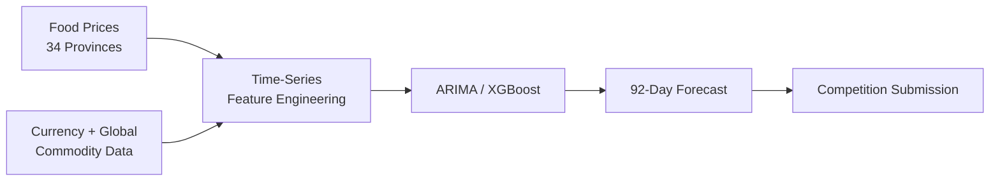

# Arkavidia 9.0 — Commodity Price Forecasting

A **Datavidia / Arkavidia 9.0** competition project for forecasting daily food commodity prices across **34 provinces in Indonesia**.

The challenge covered **13 food commodities** and required predicting prices for the final **92 days of 2024**.

> **Archive note:** This repository is preserved as an earlier data-science competition project exploring classical time-series forecasting and feature-based regression.

## Overview

The project experiments with multiple forecasting approaches, including:

- **ARIMA / `auto_arima`**
- **XGBoost regression**
- time-series interpolation
- calendar / seasonal feature engineering
- lag, moving-average, EMA, volatility, RSI, and rate-of-change features
- Indonesian public-holiday indicators
- external commodity and currency data



## ARIMA Experiment

The notebook uses `pmdarima.auto_arima` to search ARIMA parameters for individual **commodity × province** time series.

Example search configuration:

```text
p, q : 1 → 5
d    : 1
D    : 1
seasonal : enabled
```

The generated forecast covers:

```text
2024-10-01 → 2024-12-31
92 daily predictions
```

## Feature Engineering

The experiments include features such as:

```text
day of week
day / month / year
quarter
week of year

sin / cos cyclical date features
Indonesian public holidays

7 / 30 / 90-day moving averages
EMA / standard deviation
7 / 30 / 90 / 365-day lags
rate of change
RSI
```

The repository also explores joining additional **global commodity-price** and **currency exchange-rate** data.

## Dataset Scope

Examples of target commodities include:

- Bawang Merah
- Bawang Putih Bonggol
- Beras Medium / Premium
- Cabai Merah Keriting
- Cabai Rawit Merah
- Daging Ayam / Sapi
- Gula
- Minyak Goreng
- Telur Ayam
- Tepung Terigu

The competition evaluates predictions using **MAPE — Mean Absolute Percentage Error**.

## Tech Stack

- Python
- pandas
- NumPy
- `pmdarima`
- XGBoost
- scikit-learn
- Matplotlib
- holidays
- Jupyter Notebook

## What I Learned

This project gave me experience with:

- multivariate time-series data;
- ARIMA-based forecasting;
- feature engineering for temporal data;
- interpolation and missing-value handling;
- cyclical calendar features;
- external economic features;
- competition-style forecasting and submission generation.

It complements my later deep-learning projects by showing earlier experience with **classical statistical forecasting and tabular ML**.

## Status

**Archived / Arkavidia 9.0 Datavidia competition project**

The notebooks reflect experimentation during the competition rather than a polished reusable forecasting package.

## Author

Built by [MoricCosmo](https://github.com/MoricCosmo).
